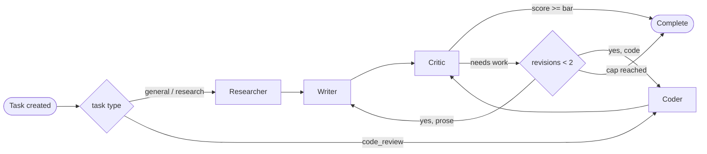
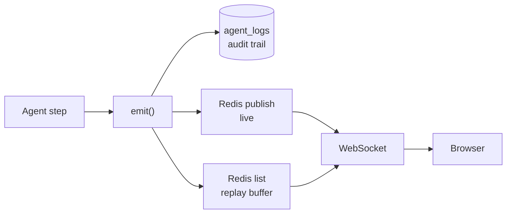

<div align="center">

# AgentHub — Agent Orchestration Hub

**Give it a task and watch four AI agents work it in real time** — every thought,
handoff and quality score streamed live, logged as a permanent audit trail, and
open to human override mid-run.

[](https://www.python.org/)
[](https://fastapi.tiangolo.com/)
[](https://langchain-ai.github.io/langgraph/)
[](https://react.dev/)
[](https://vitejs.dev/)
[](https://tailwindcss.com/)
[](LICENSE)

</div>

---

## What it is

Most LLM tools hand you an answer and ask you to trust it. AgentHub shows the
work: a **Researcher** gathers context, a **Writer** drafts, a **Critic** scores
the draft out of 100 and sends it back if it is not good enough, and a **Coder**
handles code tasks. Every step is streamed to the browser as it happens.

Two independently deployable services that share no code and talk only over
HTTP and WebSocket:

| Service | Stack | Responsibility |
|---|---|---|
| [`agenthub-backend`](agenthub-backend) | FastAPI · LangGraph · SQLAlchemy 2 · Redis | Orchestration, auth, persistence, event streaming |
| [`agenthub-frontend`](agenthub-frontend) | React 18 · Vite · Tailwind · Zustand | The live cockpit and admin dashboard |

## The agent workflow



The Critic returns a **structured verdict** — an approve/revise boolean and a
0-100 score — rather than free text, which is what lets the graph branch on
quality instead of guessing. A revision cap guarantees termination even when
the model keeps finding nitpicks.

## How an event reaches your screen



Every agent action funnels through a single `emit()` closure that does three
things: writes the audit row, publishes for live delivery, and appends to a
short-lived replay buffer.

That buffer is the interesting part. Redis pub/sub only reaches clients that
are **already** subscribed, and agents emit their first events within
milliseconds — faster than a freshly navigated browser can open a socket. The
WebSocket endpoint therefore subscribes *before* reading the buffer, then
de-duplicates by sequence number. A client connecting a full second late still
receives the run from event 1, in order, with nothing doubled.

## Features

**Orchestration**
- Four specialised agents wired as a LangGraph state machine with conditional
  routing and a bounded revise loop
- Provider-agnostic: Gemini or OpenAI, chosen from config, built lazily so a
  bad API key fails one task rather than the whole app at boot
- Human-in-the-loop override, broadcast live and recorded in the audit trail

**Live UI**
- Animated agent flow canvas with per-agent status derived from the event stream
- Scrolling thought stream, colour-coded per agent
- Agent output rendered as markdown — headings, tables, fenced code

**Access control**
- Sign-up **requests** a role; the account stays pending until an admin approves
- An admin can grant something narrower than what was asked for
- Accounts may hold both roles and switch between the workspace and the console

**Admin dashboard**
- Sign-ins, task volume, success rate, Critic score distribution, 14-day
  activity, per-agent event counts, approval queue
- **Metrics only** — an admin sees that a user ran twelve tasks averaging
  91/100, and cannot read what any of them said

## Security decisions worth reading

This is where most tutorial projects cut corners, so they are called out
explicitly:

- **The refresh token never reaches JavaScript.** It lives in an HttpOnly
  cookie scoped to `/auth`; the access token is returned in the body and held
  in memory. Nothing auth-related touches `localStorage`, so an XSS hole buys
  minutes rather than a permanent session.
- **Rotation with reuse detection.** Every refresh mints a new token and
  revokes the old one. Presenting an already-spent token revokes *every*
  session for that user — a replay and a theft are indistinguishable, so the
  safe reading is theft.
- **Roles are read from the database on every request.** The JWT carries which
  role the session is *acting as*, never a grant. Revoking admin takes effect
  on the next request instead of whenever the token happens to expire.
- **`require_admin` sits on the router, not each endpoint**, so a new admin
  route is locked by default rather than open by default.
- **Model output is never rendered as HTML** — markdown only, with raw HTML
  disabled, so agent output cannot become an injection vector.

## Quick start

No Docker, Postgres or Redis required — the defaults run on SQLite and an
in-process Redis stand-in.

**Backend** (`http://localhost:8000`, docs at `/docs`)

```bash
cd agenthub-backend
python -m venv orchestration-venv
source orchestration-venv/bin/activate   # Windows: orchestration-venv\Scripts\activate
pip install -r requirements.txt
cp .env.example .env
uvicorn app.main:app --reload --port 8000
```

**Frontend** (`http://localhost:5173`)

```bash
cd agenthub-frontend
npm install
cp .env.example .env
npm run dev
```

**One thing to fill in.** The agents need an LLM key. Put one of these in
`agenthub-backend/.env` and restart:

```env
GOOGLE_API_KEY=...     # Gemini — https://aistudio.google.com/apikey
OPENAI_API_KEY=...     # or OpenAI
```

Without it the app still runs — register, sign in, create tasks — but each task
fails at the first agent with a clear error in the thought stream.

**Create the first admin.** Nothing auto-promotes; the first admin is made out
of band, so a fresh database is never a race for who owns the platform:

```bash
python -m scripts.set_role you@example.com user,admin
```

## Configuration

Full list with comments in [`agenthub-backend/.env.example`](agenthub-backend/.env.example).

| Variable | Purpose |
|---|---|
| `DATABASE_URL` | `sqlite+aiosqlite:///./agenthub.db` for local dev, `postgresql+asyncpg://…` in production |
| `REDIS_URL` | `memory://` for the in-process stand-in, or a real `redis://` URL |
| `SECRET_KEY` | JWT signing key — `python -c "import secrets; print(secrets.token_urlsafe(32))"` |
| `GOOGLE_API_KEY` / `OPENAI_API_KEY` | One is required for agents to run |
| `LLM_PROVIDER` / `LLM_MODEL` | `auto` by default; override to pin a provider or model |
| `COOKIE_SECURE` | `True` in any real deployment |
| `LOG_LEVEL` / `SQL_ECHO` | Terminal verbosity; SQL echo is deliberately separate from `DEBUG` |

## Project structure

```
agent-orchestration-hub/
├── agenthub-backend/
│   ├── app/
│   │   ├── agents/          # the four agents + LangGraph graph + LLM factory
│   │   ├── api/routes/      # auth, oauth, tasks, websocket, admin, health
│   │   ├── core/            # security, tokens, dependencies, logging, redis
│   │   ├── models/          # SQLAlchemy models + portable column types
│   │   ├── schemas/         # Pydantic request/response contracts
│   │   └── services/        # orchestration, streaming, analytics
│   ├── alembic/             # migrations (Postgres)
│   └── scripts/set_role.py  # admin bootstrap
└── agenthub-frontend/
    └── src/
        ├── components/      # agents/, admin/, tasks/, layout/, ui/
        ├── pages/           # one per route
        ├── store/           # Zustand: auth, tasks, admin
        └── hooks/           # the WebSocket connection
```

## Deployment notes

SQLite and the in-process Redis are a **development convenience**, not the
deployment target. For production, point `DATABASE_URL` and `REDIS_URL` at real
services and run `alembic upgrade head`; `docker compose up --build` in the
backend folder brings up Postgres, Redis and the API together. The in-process
Redis stand-in only supports a single worker, since it lives inside the API
process.

## Roadmap

- Inject a human override into a LangGraph run already in flight, rather than
  applying it at the next node
- Per-user API keys (`users.byo_api_key` exists; the code path does not yet)
- Syntax highlighting and LaTeX rendering in agent results
- A unique index on `(user_id, lower(title))` to close the duplicate-title
  check's query-then-insert race

## License

[MIT](LICENSE) © ukroy07

<div align="center">

Built by [ukroy07](https://github.com/ukroy07) ·
[LinkedIn](https://www.linkedin.com/in/ukroy07/) ·
[LeetCode](https://leetcode.com/u/ukroy07/)

</div>
